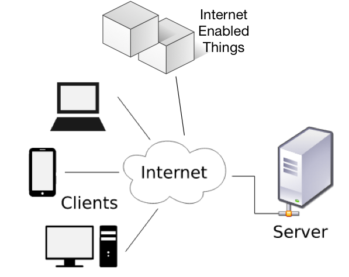

# Introduction

This guide will walk you through the code, technology, hardware and
step-by-step instructions to:
- Connect micro-controller unit (focus on ESP 8266) to the Internet. 
- Control such microcontrollers securely over HTTP protocol (to act in
the real-world).
- Gather data from such micro-controllers into a server/database
- Develop simple web clients to anayze the collected data.

Why would we need to learn any of this? To understand this we need to
look at the past, present and future of the Internet. Since it's
inception in the 1990's the commercial Internet has expanded at an
exponential rate (measured by number of connected devices). Starting
from server main-frames, moving on to desktop, laptop computers, we now
have Internet on handheld devices. This trend will continue (powered by
cheap internect connected MCUs, and secure IoT backbones available on
demand. See Figure below for one such prediction.


This explosion in connected devices will bring in a new era of
customized connected electronics, vast changes in business logic,
supply-chain management, AI integration, home automation, media, smart
cities etc. This guide is concerned with the engine that will largely
shape the nacest IoT landscape. This guide focusses on programming ESP
8266 MCU, sensing and actuating these sensors over the Internet (AWS
services used in guide, but examples can work with any IaaS provider).
There are even examples of voice activation with Echo!

Suffice it to say IoT will be a marketable skill over the next few
years. If you need more motivation read
[this](https://www.computer.org/cms/Computer.org/ComputingNow/issues/2015/07/mit2015030002.pdf)
[this](https://www.abiresearch.com/press/more-than-30-billion-devices-will-wirelessly-conne/),
[this](http://internetofthingsagenda.techtarget.com/feature/Can-we-expect-the-Internet-of-Things-in-healthcare),
[this](http://www.businessinsider.com/internet-of-everything-2015-bi-2014-12) and [references
of this](https://en.wikipedia.org/wiki/Internet_of_things#Applications).


This guide is organized around experiments (see 'IoT Experiments'
secion. The experiments are organized in an increasing order on
complexity, to facilitate learning. However feel free to go through
these experiments out of order after you have mastered the
prerequisites. 

The code references (when applicable) in this guide is organized into 3 parts:
 


- MCU -- the code used to program the micro-controller unit (ESP 8266
via the Arduino IDE)
- Server -- the cloud server that connects and controls the MCU.
- Client -- Simple HTML web-client to display results/analytics.


# Basics
This section discusses some concepts that are needed to follow along wit
this guide. Concepts covered here are cross-referenced throughout the guide.


## The Client-Server Model


The client-server model is the backbone of the World Wide Web (www) and
is one of the most important protocols to comminucate withg
Internet-enabled 'Things'. The server is a program (not necessarily
running on a 'big' computer, but any Microprocessor/Microcontroller)
that can receive requests at a specific port, and respond back to the
client that sent the request. The most common example of this is HTTP
servers that send file data (HTML, images, js, css etc.) like
Read more: 
<a href='https://en.wikipedia.org/wiki/Client%E2%80%93server_model'
target='_blank'> Wikipedia Article </a>.
google.com, yahoo.com or any other web server. 

This guide will teach you
how to write 'Web Services' that can interact with your HTML
web-clients. More importantly it will teach you to write
micro-controller code that can interact with your web-services



The rapid growth of internet connected devices (estimated to be 50B in
2020) will come as a result of
small everyday devices that can log data and do simple tasks. This guide
focusses on such examples.


## Uniform Resource Locator (URL)


## Prerequisites
This guide assumes you have intermediate proficiency with the following
technologies. If you need a refresher or a tutorial check out the
references (basic overview provided in the next section).

Tool/Technology | References
---- | ----
Front-end Web technologies (HTML/CSS/JS) | [CSS Tutorial](https://www.w3schools.com/jquery/), [HTML5 Tag reference](http://www.w3schools.com/tags/), [jQuery API Reference](http://api.jquery.com/), [Bootstrap JS Reference](http://getbootstrap.com/javascript/), [JS Tutorial](http://www.w3schools.com/js/), [CSS Animations](http://www.w3schools.com/css/css3_animations.asp), [JSON](http://www.json.org/)
Backend server (Node.js used in this guide) |[Node.js Get Started Documentation](http://nodeguide.com/beginner.html), [Node mongoskin](https://github.com/kissjs/node-mongoskin), [AWS Lightsail](https://aws.amazon.com/blogs/aws/amazon-lightsail-the-power-of-aws-the-simplicity-of-a-vps/),  
No-Sql Database (mongoDB used in guide) | 
Arduino IDE |
Hardware | 


# Tools

## Arduino IDE

## esptool.py

## AWS Lightsail

## AWS Lambda

## Node.js

## mongoDB

> To authorize, use this code:

# IoT Experiments

## Hello World
### Hello World - Server
  A simple HTTP server that send the string "Hello World" as response to
every http GET request.


Starting by installing Node.js ([install instructions](#node-js)) on
your machine. We will write a server that listens to
localhost(127.0.0.1) at port 8080 (see aside on URLs for a discussion on
ports).

```javascript
var http = require("http");

function callback (req, res) { // req -> request object; res -> response object
   res.writeHead(200, {'Content-Type': 'text/plain'}); // send response header
   res.end("hello world"); // send response body
}

var server = http.createServer(callback) // create an http server
server.listen(8080, "127.0.0.1"); // make server listen to port 8080
console.log("Server running at: "+ "http://127.0.0.1:8080");
```

Take a look at the code in the 'Node.js' section ([full code for example](https://github.com/tejaswigowda/IoTStarterKit/tree/master/IoTExperiments/helloWorldServer)). 


### Hello World - Internet connected <i style='text-transform:lowercase'>&mu;</i>C


## Scan for Wifi Networks

## Turn on/off LED via Web-server

## Turn on/off LED via Internet

## Internet connected Push Button

## Push button to send email

## Push Button to send temperature/humidity as email

## Graphing temperature and humidity

## Logging sensor values in a database

## Sending alerts when certain values are out of range

## Dimming LEDs with Pulse Width Modulation (PWM)

## Control RGB lights

## Play MIDI over the Internet

## Turn on/off any AC device using relay

## Control 2 color LED

## Control 1-bit display

## Use 7 color flash to alert high temperature (IR LED)

## Use Tap module to send morse-code to server

## Automatic light switch (with data logging)

## Motion switch (with data logging)

## Shock sensors for logging shocks

## Internet enabled touch switch (with hot keys)

## A blind navigation tool (with data logging)

## Control fan speed with a magnet (with data logging)

## Connected home --  control LEDs with Echo

## More to come
  The componets in the IoT starter kit can be used for many more
experiments. If you want your experiment to be featured here, please
submit your experiment [here]().

```shell
require 'kittn'

api = Kittn::APIClient.authorize!('meowmeowmeow')
```

```js
import kittn

api = kittn.authorize('meowmeowmeow')
```

```shell
# With shell, you can just pass the correct header with each request
curl "api_endpoint_here"
  -H "Authorization: meowmeowmeow"
```

> Make sure to replace `meowmeowmeow` with your API key.

